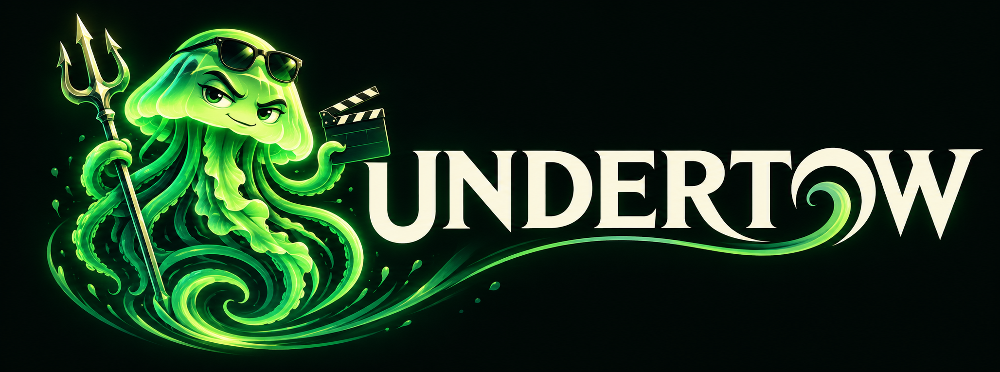

# Undertow

Undertow brings Jellyfin libraries into Emby. Install the plugin in Emby, connect a source, and browse its movies and series in Emby's native apps.

It is the successor to [InfiniteDrive](https://github.com/OneHotTake/InfiniteDrive). We run it in production. We also break it in production. See [How we run it](docs/how-we-run-it.md) for our setup.

**Target: Emby 4.10.0.40. One source per Emby instance.**

## Why we replaced InfiniteDrive

InfiniteDrive built a library from addon manifests. It wrote metadata and stream files, expanded episodes, and repaired expired links. We spent too much time maintaining the plumbing.

Jellyfin already supplies libraries, movies, series, seasons, episodes and playback sources. Undertow imports that structure into Emby and requests versions when needed. The source manages its catalog. Emby handles metadata, users and playback.

InfiniteDrive's code stays available. Undertow does not migrate its database, lists, blocks or watch history. Read the [migration guide](docs/migration.md) before removing the old library.

## What it does

- Imports movies, series, seasons and episodes into an Emby channel.
- Separates anime movies and series using anime IDs or catalog origin.
- Refreshes metadata manually or on a schedule.
- Keeps existing titles when an upstream catalog changes. Sync is additive.
- Optionally skips movie and series IDs already in the local library and removes matching Undertow duplicates during refresh. Series are all or nothing: a local series ID skips the entire Undertow series, even when only some episodes are owned.
- Optionally checks recent movies without a confirmed home release and publishes them only when the source returns usable candidates. Empty lookups withhold or remove their Undertow entries; lookup errors preserve the previous decision.
- Requests playback versions on demand and probes only the selected file.
- Uses Emby's metadata providers, audio preferences and playback pipeline.
- Shows recent unavailable-source diagnostics in Maintenance.
- Includes default folder artwork in the DLL; preserves existing images.

Catalog refresh fetches metadata. It does not resolve streams or write STRM and NFO files. The optional recent-movie task deliberately performs a small, paced set of candidate searches, which can query upstream addons and indexers. The selected file's probe may resolve its final URL before playback.

## Publish recent movies when streams appear

V0.47.0 adds **Maintenance → Check recent movies without a confirmed home release**. It is off by default. Supply a TMDB API key or read access token, enable it, save and refresh. See [Movie availability](docs/movie-availability.md) for the complete rules and limits.

The TMDB credential reads digital, physical and TV release dates so Undertow can limit which recent movies need a source check. TMDB does not supply streams; those still come from your configured source. This credential is required only for this optional feature, not ordinary catalog import or playback.

Movies released within the last 365 days need a usable source result if TMDB has no past digital, physical or TV release. Upcoming movies wait until their premiere date. Older movies, series and locally owned duplicates are outside this background search queue. Missing release metadata is not proof a movie has no streams.

The native task checks at most one movie per minute and once per movie per 24 hours, with a ceiling of 48 background source attempts per rolling 24 hours. It uses the same upstream profile, release filters and source translation as playback. It never opens a video, probes tracks or downloads media. Normal playback lookups satisfy the daily check too.

Any usable candidate makes the movie eligible for Emby's native catalog and version selection. A completed lookup returning none withholds a new movie or removes its existing Undertow entry. Errors and timeouts retain the previous decision. Catalog metadata stays saved so a later positive result can republish the same source identity. Playback still obtains fresh versions on demand; availability evidence is not a saved permanent stream URL or a guarantee of device compatibility.

Disable the switch, save and refresh to restore ordinary additive publication. This feature controls Undertow movies only; it does not delete local media or alter acquisition requests. V0.47.0 includes the feature; see [verification](docs/verification.md) for dated deployment checks and limitations.

## Skip titles you already own

The current source adds **Maintenance → Skip titles already in the local library**. It is off by default. Enable it, save, then refresh.

Undertow looks up IMDb, TMDB and TVDB IDs in the local Emby library. A matching movie skips that Undertow movie. A matching series skips the **entire series**, including every season and episode. This is all or nothing: owning just one season or a few episodes still skips the whole Undertow series. Undertow does not check episode completeness or fill gaps in an owned series.

Refresh also removes matching entries already imported by Undertow. It preserves local media files and the saved upstream catalog metadata. Turn the switch off, save and refresh to republish the retained entries. Pathless channel entries, remote entries and STRM movie files do not count as local ownership. A local series is identified by its library folder path. Movie and series IDs are matched separately; titles and years are not used to guess a match.

This prevents duplicates between Undertow and the local library. It does not remove duplicate physical files or collapse different cuts already in that library. See [Settings](docs/settings.md) for details. V0.46.1 includes this feature.

## Install

1. Download `Undertow.dll` from the [latest release](https://github.com/OneHotTake/undertow/releases/latest).
2. Stop Emby and copy it into the plugins directory. Remove the older `Jellyembifier.dll` if present. Keep the existing configuration and data; install one copy.
3. Restart Emby. Open **Dashboard → Plugins → Undertow → Settings**.
4. Enter the source's server address, username and password. Some compatible servers use a profile ID as the username.
5. Choose catalogs, then select **Maintenance → Refresh now**.
6. Test a movie and an episode. Set the refresh interval when ready.

See [Setup](docs/setup.md) and [Settings](docs/settings.md) for details.

## What we tested

We tested stock Jellyfin 12.2.0 and other compatible servers. The stock Jellyfin test imported one movie and a series with five seasons and 44 episodes. The movie and pilot played through Emby. V0.42.3 added the authorization header required by that server.

V0.47.0 passed 82 contract checks and production publication checks for positive, empty and upcoming movies. Earlier V0.42.5 production checks returned twelve versions for a movie and an episode, selected English audio, and preserved the existing library IDs.

Other Jellyfin-compatible servers should work if they implement the [required API](docs/compatibility.md). Test yours. Short decoder checks do not prove a whole film, HDR, subtitles, seeking or every Apple device. See the [verification report](docs/verification.md) for dated results and gaps.

## Infuse

The local October 9 [native-library experiment](docs/native-library-experiment.md)
also tested ordinary fileless Movie/TV libraries. Their IDs and progress survived
scans/restart without source searches, but Infuse still failed on placeholder
item-detail sources. This branch is a lab prototype, not a released feature.

Connect Infuse directly to the Jellyfin source. Keep its Emby connection for owned media.

Infuse reads versions from item details. Emby returns stored sources there; Undertow discovers versions through Emby's playback callbacks. We tested workarounds and retired them. Preparing versions for the entire catalog would defeat lightweight sync.

Use Emby's native clients for Undertow. See the [Infuse guide](docs/infuse.md) for the evidence and direct connection setup.

## Limits

- One upstream source per Emby instance.
- Native Emby search covers imported titles only.
- Ordinary sync is additive. Explicit duplicate and recent-movie availability filters can remove Undertow entries; no watch progress is forwarded upstream.
- Sources requiring upstream session opening and closing are unsupported.
- A native static-proxy path fails. Remux delivery works in the tested cases.
- ASS subtitle rendering remains unresolved.

## Build and report bugs

Run `bash scripts/build.sh` on a Docker host. It extracts references from the pinned Emby 4.10.0.40 image, builds with .NET 8 and runs the contract checks. It does not restart Emby or include Emby assemblies in the release.

Use sources you are authorized to access. File bugs in [Issues](https://github.com/OneHotTake/undertow/issues). Include versions and redacted logs. Keep credentials and signed stream URLs out of them.

## License

MIT. See [LICENSE](LICENSE).

Vibe coded with Codex, Claude, and whoever still had a free trial. I put it in production, so apparently I'm the adult supervision. Guaranteed to have bugs. Probably some I haven't met yet. Good luck. Bring logs.
